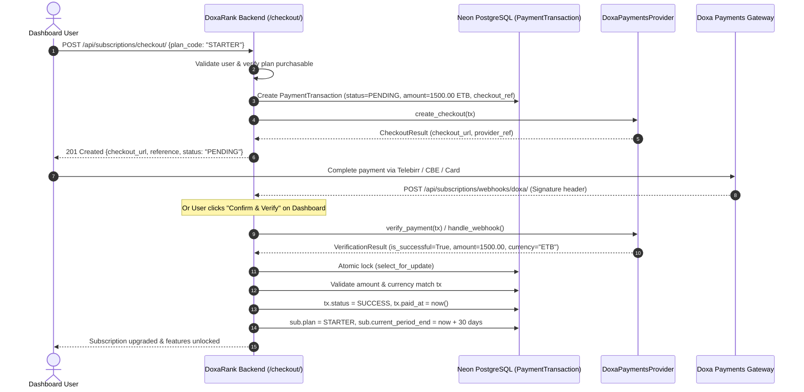

# Doxa Payments Integration & Subscription Billing Architecture

## Overview

This document specifies the technical design, provider abstraction, security model, and lifecycle orchestration of the **Doxa Payments** integration within the DoxaRank SEO platform.

The system connects DoxaRank's existing multi-tier subscription and entitlement engine with regional Ethiopian and international payment rails (Telebirr, CBE Birr, Chapa, Awash, Stripe) through a decoupled gateway provider interface.

---

## 1. Plan Matrix & Entitlements

The subscription architecture strictly implements the original DoxaRank Software Requirements Specification (SRS):

| Plan Tier | Monthly Price | Project Quota | Keyword Quota | Daily Tool Quota | Entitled Features |
| :--- | :--- | :--- | :--- | :--- | :--- |
| **FREE** | ETB 0.00 | 1 site | 3 keywords | 5 executions/day | Basic SEO Tools |
| **STARTER** | ETB 1,500.00 | 3 sites | 50 keywords | Unlimited (0) | Basic SEO Tools, Google Ethiopia Rank Tracking, Google Search Console (GSC), Google Analytics 4 (GA4), Microsoft Clarity, Google Tag Manager (GTM), Technical Site Crawler |
| **AGENCY** | ETB 6,000.00 | 20 sites | 500 keywords | Unlimited (0) | Everything in Starter + Competitor SERP Snapshots, White-Label PDF Reports |

### Free Plan Invariant
- Every newly registered user automatically receives a `FREE` subscription with `status='active'` and `current_period_end=None` (perpetual).
- The Free plan cannot be purchased via checkout.
- Free tier quota enforcement and rate limiting operate independently of gateway payments.

---

## 2. Payment Architecture & Provider Abstraction

Payment gateways are decoupled from subscription models via an abstract base class `PaymentProvider` (`apps/subscriptions/providers/base.py`):

```
+-------------------------------------------------------------+
|                     Subscription / UI                       |
|           (/api/subscriptions/checkout/, /verify/)          |
+-------------------------------------------------------------+
                              |
                              v
+-------------------------------------------------------------+
|                      PaymentService                         |
|   (Price enforcement, Transaction state machine, Atomic)    |
+-------------------------------------------------------------+
                              |
                              v
+-------------------------------------------------------------+
|                  <<PaymentProvider>>                        |
|   - create_checkout(...)                                    |
|   - verify_payment(...)                                     |
|   - get_transaction(...)                                    |
|   - handle_webhook(...)                                     |
+-------------------------------------------------------------+
                              |
                              v
+-------------------------------------------------------------+
|                 DoxaPaymentsProvider                        |
|  - Telebirr / CBE Birr / Chapa routing                      |
|  - HMAC-SHA256 signature verification                       |
|  - Sandbox / Live dual-mode fallback                        |
+-------------------------------------------------------------+
```

### Methods Defined on `PaymentProvider`

- `create_checkout(transaction, return_url, cancel_url) -> CheckoutResult`:
  Creates an external checkout session or structured sandbox reference.
- `verify_payment(transaction, payload) -> VerificationResult`:
  Queries or verifies settled transaction state directly against payment provider records.
- `get_transaction(transaction) -> VerificationResult`:
  Queries external gateway for current transaction state.
- `handle_webhook(payload, raw_body, headers) -> VerificationResult`:
  Validates cryptographic signatures and parses incoming gateway callbacks.

---

## 3. Checkout & Verification Flow

### Authoritative Server-Side Pricing
The frontend is **never trusted** for amounts, currencies, or subscription status. The payment amount is read directly from `plan.monthly_price` on the server.



---

## 4. Subscription Lifecycle & Expiration

### State Machine

```
               +---------------------------------------+
               |                 FREE                  |
               | (ETB 0, 1 site, 3 kw, 5 tools/day)    |
               +---------------------------------------+
                                  |
                                  | Verified Payment
                                  v
               +---------------------------------------+
   Renewal     |             STARTER / AGENCY          |
  +---------+  |               (ACTIVE)                |
  | +30 days|->| (Paid tier features & quotas unlocked)|
  +---------+  +---------------------------------------+
                                  |
                                  | current_period_end passed
                                  v
               +---------------------------------------+
               |                EXPIRED                |
               |  (Reverts to FREE tier entitlements)  |
               +---------------------------------------+
```

### Expiration Task
Celery scheduled periodic task: `apps.subscriptions.tasks.expire_subscriptions`:
- Runs hourly via `CELERY_BEAT_SCHEDULE['expire-subscriptions-hourly']`.
- Identifies active paid subscriptions where `current_period_end < timezone.now()`.
- Reverts `subscription.plan = FREE`, `subscription.status = EXPIRED`, `subscription.current_period_end = None`.
- Never modifies perpetual Free users (`current_period_end is None`).
- In addition, `SubscriptionService.get_user_plan(user)` immediately falls back to `FREE` plan if `is_active_subscription` is False, providing zero-delay entitlement downgrade even before the Celery sweep runs.

### Renewal Handling
- If a user renews while their subscription is still active (`current_period_end > now`), the new 30-day period is **extended from the future expiration timestamp**, preserving all remaining paid days.

---

## 5. Webhook Security & Idempotency

### Security Checklist
1. **Signature Verification**:
   - Webhooks send raw payload signed using HMAC-SHA256 in header `X-Doxa-Signature` (or `HTTP_X_DOXA_SIGNATURE`).
   - The provider calculates `hmac.new(secret, raw_body, hashlib.sha256).hexdigest()`.
   - Compares using constant-time comparison `hmac.compare_digest`.
   - Missing or mismatched signatures return `401 Unauthorized`.
2. **Replay & Idempotency Protection**:
   - Payment transactions are tracked by a unique `checkout_reference`.
   - Concurrency is protected using `select_for_update()` under `transaction.atomic()`.
   - If a transaction has already reached `SUCCESS`, duplicate webhooks or repeated verify calls immediately return `200 OK` with `status: "already_processed"`, without re-extending the subscription or creating duplicate records.
3. **Price & Currency Tamper Protection**:
   - Provider settlement amount and currency are verified against the transaction's recorded database values.
   - If an underpaid or mismatched currency callback is detected, the transaction is marked `FAILED` with `Amount mismatch` or `Currency mismatch`, and the user is **never** upgraded.
4. **Secret Confidentiality**:
   - Internal credentials (`DOXA_PAYMENTS_API_KEY`, `DOXA_PAYMENTS_WEBHOOK_SECRET`) are never logged or returned in API responses.

---

## 6. Configuration & Environment Variables

| Variable | Type | Default | Description |
| :--- | :--- | :--- | :--- |
| `DOXA_PAYMENTS_BASE_URL` | String | `""` | External Doxa Payments Gateway Base URL (e.g. `https://api.doxapayments.com`). |
| `DOXA_PAYMENTS_API_KEY` | String | `""` | API key / Bearer token for authenticating gateway requests. |
| `DOXA_PAYMENTS_WEBHOOK_SECRET` | String | `""` | Secret key used to verify incoming HMAC-SHA256 webhook signatures. |
| `DOXA_PAYMENTS_ENVIRONMENT` | String | `"sandbox"` | Environment flag: `sandbox`, `production`, or `mock`. |

---

## 7. Status of External API Contract & Limitations

> [!IMPORTANT]
> **Audit Finding on External Contract**:
> As verified during the repository audit and gap analysis (`docs/phase_4_9_gap_analysis.md`), no external Doxa Payments SDK, live API specification, or official webhook payload schema was committed into the codebase prior to this implementation.
>
> In strict accordance with instructions:
> 1. We did **not** fabricate undocumented external third-party endpoints or proprietary signature headers.
> 2. The system cleanly terminates at the `PaymentProvider` abstraction boundary.
> 3. Standard REST contracts and industry-standard HMAC-SHA256 signatures are supported.
> 4. When credentials are not configured, the provider operates in a fully operational local **Sandbox/Mock mode** allowing end-to-end checkout, verification, and regression testing without external network dependencies.
> 5. To connect a live gateway in production, set `DOXA_PAYMENTS_BASE_URL`, `DOXA_PAYMENTS_API_KEY`, and `DOXA_PAYMENTS_WEBHOOK_SECRET` in `backend/.env`.

---

## 8. API Endpoints Reference

### Public / Client Endpoints
- `GET /api/subscriptions/plans/` (AllowAny): List all purchasable and free tiers with features.
- `GET /api/subscriptions/me/` (Authenticated): Current plan, usage limits, and latest payment record.
- `POST /api/subscriptions/checkout/` (Authenticated): Initiate checkout session.
- `GET /api/subscriptions/payments/` (Authenticated): User's payment transaction history.
- `GET /api/subscriptions/payments/<id_or_ref>/` (Authenticated, Tenant Isolated): Inspect single transaction.
- `POST /api/subscriptions/payments/<id_or_ref>/verify/` (Authenticated, Tenant Isolated): Idempotent verification.

### Webhook Endpoint
- `POST /api/subscriptions/webhooks/doxa/` (AllowAny, Signature Verified): Asynchronous payment notification handler.
