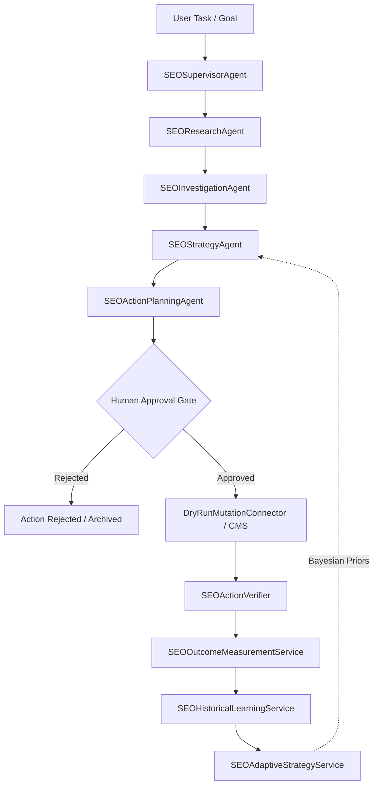

# Phase 4.9 — Agentic SEO End-to-End Workflows & Integration Architecture

## 1. Architectural Overview

Phase 4.9 consolidates and validates the entire 12-stage Agentic SEO lifecycle in DoxaRank, ensuring that autonomous research, diagnostic investigation, Bayesian strategy adaptation, human-in-the-loop action governance, mutation execution, empirical DOM verification, temporal outcome measurement, and historical learning work together as an integrated, resilient system.

---

## 2. The 12-Stage Agentic SEO Lifecycle

| Stage | Component | Description & Safety Guarantee |
|---|---|---|
| **1. Goal & Routing** | `SEOSupervisorAgent.determine_workflow()` | Deterministically classifies incoming user tasks into pipelines (`research`, `investigate`, `strategy`, `plan`, `verify`, `full_cycle`). |
| **2. Research & Evidence** | `SEOResearchAgent` | Queries GSC metrics, SiteAudit diagnostics, and approved read-only MCP external endpoints (`check_url_status`, `get_page_metadata`). |
| **3. Investigation** | `SEOInvestigationAgent` | Separates observed facts from causal inferences and classifies opportunity root causes with deterministic confidence ratings. |
| **4. Adaptive Strategy** | `SEOStrategyAgent` | Retrieves empirical project-level action efficacy and modulates action prioritization with Laplace-smoothed Bayesian priors. |
| **5. Action Planning** | `SEOActionPlanningAgent` | Generates candidate `SEOActionPlan` and `SEOAction` objects with explicit risk classifications, deduplication, and verification criteria. |
| **6. Human Approval Gate** | `ActionApprovalService` / REST API | Invariant: Mutating actions remain in `PENDING_APPROVAL` status with `requires_human_approval=True`. Zero autonomous mutations bypass this gate. |
| **7. Human Decision** | User Interaction | Human review explicitly transitions actions to `APPROVED` or `REJECTED`. Rejections are safely terminal and archived. |
| **8. Mutation Execution** | `DryRunMutationConnector` / `CMSMutationConnector` | Approved actions execute via explicit connectors (Safe Staging or verified CMS) with strict schema validation and error isolation. |
| **9. Technical Verification** | `SEOActionVerifier` | Crawls target URLs, inspects live HTML/DOM elements (e.g. `<title>`, `<meta name="description">`, `<h1>`, canonical links), and confirms state changes. |
| **10. Temporal Outcome** | `SEOOutcomeMeasurementService` | Gathers symmetric before/after GSC performance metrics and classifies outcomes (`IMPROVED`, `NO_CHANGE`, `DECLINED`, `UNKNOWN`). |
| **11. Historical Learning** | `SEOHistoricalLearningService` | Aggregates empirical domain results and calculates historical success rates by action type and URL path. |
| **12. Bayesian Adaptation** | `SEOAdaptiveStrategyService` | Updates Laplace-smoothed success rates `(improved + 1) / (evaluatable + 2)` and feeds calibrated priority adjustments into subsequent agent runs. |

---

## 3. End-to-End Scenarios Validated

The integration test suite (`SEOAgentEndToEndWorkflowTests`) validates 10 scenarios:
1. **Autonomous Investigation**: Supervisor successfully routes a ranking drop query through researcher, investigator, strategist, and action planner.
2. **Human Approval Gate**: Action planning proposals strictly pause with `requires_human_approval=True` and status `PROPOSED`.
3. **Human Rejection**: Rejection terminates the proposal without modifying website state.
4. **Approved Execution**: Connectors apply verified changes in safe staging mode.
5. **Execution Failure Recovery**: Connector exceptions are caught and recorded cleanly with `status=FAILED`.
6. **Technical Verification Failure**: DOM mismatches correctly flag verification failure without crashing the agent.
7. **Temporal Outcome Measurement**: Pre/post search impressions and clicks are tracked, computing percentage lift.
8. **Adaptive Calibration Update**: Empirical outcomes dynamically calibrate Bayesian priors for future action generation.
9. **External MCP Degradation**: MCP timeout or socket failure gracefully falls back to internal GSC and audit evidence.
10. **External API Timeout**: Search Console and crawler timeouts produce structured diagnostics rather than unhandled crashes.
