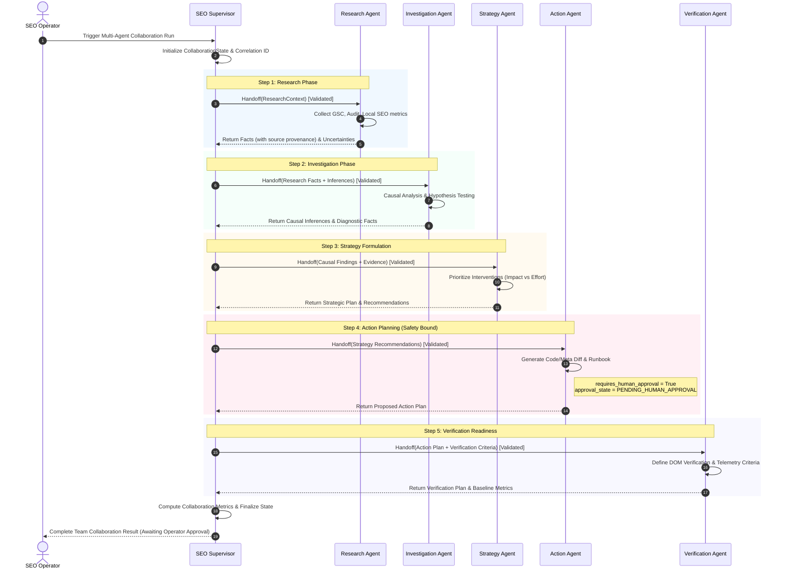

# DoxaRank Phase 5.1 — Advanced Multi-Agent Collaboration & Structured Agent Handoffs

## 1. Architecture Overview

Phase 5.1 evolves DoxaRank's Phase 4.7 specialized-agent orchestration into a **formal, structured multi-agent collaboration architecture**. Prior to Phase 5.1, specialized agents executed sequentially sharing an untyped dictionary or generic context without strict contract boundaries, typed provenance, or pre-acceptance verification.

In Phase 5.1, agent interactions are governed by:
- **`AgentHandoffContext`**: A strictly typed dataclass contract specifying source/target agents, scoped evidence, categorized findings, tool permissions, and explicit approval states.
- **`AgentHandoffValidator`**: A runtime gate that validates every handoff prior to target agent execution, preventing unauthorized privilege escalation, cross-tenant leaks, and ungrounded claims.
- **`CollaborationState`**: An explicit execution tracker capturing completed, pending, and failed agents alongside full handoff history.
- **Categorized Epistemic Separation**: Strict distinction between **Observed Facts**, **Inferences**, **Uncertainties**, and **Recommendations/Assumptions**.
- **Failure Isolation Semantics**: Degraded execution mode where failing agents do not discard preceding high-confidence findings.
- **Immutable Safety Bounds**: Strict preservation of human approval gates (`requires_human_approval = True`) for any mutating actions.

```
                    ┌─────────────────────────┐
                    │      SEO Supervisor     │
                    └────────────┬────────────┘
                                 │
     ┌───────────────────────────┼───────────────────────────┐
     │                           │                           │
     ▼                           ▼                           ▼
┌───────────────┐  Handoff   ┌───────────────┐  Handoff  ┌───────────────┐
│Research Agent │ ─────────> │ Investigation │ ────────> │Strategy Agent │
│               │ (Validated)│     Agent     │(Validated)│               │
└───────────────┘            └───────────────┘           └───────┬───────┘
                                                                 │
                                                    Handoff      │ (Validated)
                                                                 ▼
┌───────────────┐  Handoff   ┌───────────────┐           ┌───────────────┐
│ Verification  │ <───────── │ Action Agent  │ <─────────┤ Action Agent  │
│     Agent     │ (Validated)│ (PROPOSED)    │           │ (Plan & Risk) │
└───────────────┘            └───────────────┘           └───────────────┘
                                     │
                                     ▼
                        [Human Approval Invariant]
                        (No Autonomous Execution)
```

---

## 2. Agent Team Members and Responsibilities

The specialized SEO agent team collaborates with strict functional boundaries:

| Agent Identifier | Core Responsibility | Input Dependencies | Output Distinctions |
| :--- | :--- | :--- | :--- |
| `seo_research_agent` | Gathers raw metrics, search query performance, audit signals, and competitor baselines. | User goal, target domain, GSC/Audit tools. | **Observed Facts** (verifiable data with tool provenance) & **Uncertainties** (missing historical baselines). |
| `seo_investigation_agent` | Analyzes causality behind metric drops, algorithmic updates, technical defects, or cannibalization. | Research Agent's observed facts and uncertainties. | **Causal Inferences** (probabilistic hypotheses with confidence ratings) & Diagnostic facts. |
| `seo_strategy_agent` | Synthesizes prioritized, high-impact interventions based on causal findings and domain win rates. | Investigation inferences and research metrics. | **Prioritized Strategy Inferences** & Recommended interventions with effort/impact trade-offs. |
| `seo_action_agent` | Generates concrete, step-by-step implementation plans and code/metadata diffs. | Strategy recommendations & risk parameters. | **Proposed Action Plans** with `requires_human_approval = True` and explicit safety constraints. |
| `seo_verification_agent` | Validates live DOM deployment, monitors SERP re-indexing, and measures outcome metrics. | Action implementation specifications & baseline metrics. | **Verification Observations** (HTTP status, DOM tags, post-change ranking shifts). |

---

## 3. Structured Handoff Contract Schema

The handoff contract is implemented via `AgentHandoffContext` (`backend/apps/seo/services/agents/agent_handoff.py`):

```python
@dataclass
class AgentHandoffContext:
    handoff_id: str                      # Unique UUID for the handoff transaction
    correlation_id: str                  # Distributed tracing correlation ID
    project_id: str                      # Multi-tenant isolation project ID
    source_agent: str                    # Sender agent identifier
    target_agent: str                    # Recipient agent identifier
    user_goal: str                       # Overarching user objective
    task_type: str                       # Specific task delegation type
    timestamp: str                       # ISO-8601 handoff generation time
    relevant_evidence: List[Dict[str, Any]]     # Minimally-scoped evidence payload
    observed_facts: List[Dict[str, Any]]        # Verifiable empirical facts
    inferences: List[Dict[str, Any]]            # Derived probabilistic conclusions
    uncertainties: List[Dict[str, Any]]         # Explicitly declared gaps/ambiguities
    assumptions: List[str]                      # Foundational operating assumptions
    allowed_tools: List[str]                    # Explicit tool permission allowlist
    approval_state: str                         # e.g., "NOT_REQUIRED", "PENDING_HUMAN_APPROVAL"
    requires_human_approval: bool               # Safety invariant flag
    risk_information: Dict[str, Any]            # Risk assessment scores and warnings
    previous_agent_steps: List[Dict[str, Any]]  # Execution chain breadcrumbs
    metadata: Dict[str, Any]                    # Contextual extensibility metadata
```

---

## 4. Evidence Lifecycle and Provenance Preservation

To ensure hallucinations and assumptions never masquerade as empirical truths, all data transferred across handoffs is strictly typed into four epistemic categories:

1. **Observed Facts (`EvidenceItem`)**:
   - Strictly empirical, verified data.
   - Must contain: `fact_id`, `statement`, `source_type` (`"tool"`, `"gsc"`, `"audit"`, `"dom"`, etc.), `source_reference`, `observed_at`, and `confidence: 1.0`.
2. **Inferences (`InferenceItem`)**:
   - Probabilistic deductions or hypotheses derived from facts.
   - Must contain: `inference_id`, `hypothesis`, `supporting_fact_ids`, `confidence` (0.0 to 1.0), and `derivation_rationale`.
3. **Uncertainties (`UncertaintyItem`)**:
   - Declared knowledge gaps, ambiguous signals, or missing baseline telemetry.
   - Must contain: `uncertainty_id`, `description`, `impact_level` (`"low"`, `"medium"`, `"high"`), and `suggested_resolution`.
4. **Assumptions & Recommendations**:
   - Hypotheses that cannot be directly proven but are required to proceed without blocking execution.

### Provenance Preservation Invariant
Every downstream agent preserves preceding observed facts and links new inferences to `supporting_fact_ids`. The supervisor evaluates an **Evidence Provenance Score** (`evidence_provenance_score`) measuring the ratio of grounded facts with verifiable sources.

---

## 5. Pre-Acceptance Handoff Validation Rules

Before an agent accepts an incoming `AgentHandoffContext`, `AgentHandoffValidator.validate()` executes the following mandatory integrity checks:

1. **Agent Identifier Allowlist**: `source_agent` and `target_agent` must belong to the registered `KNOWN_AGENTS` registry (`seo_supervisor`, `seo_research_agent`, `seo_investigation_agent`, `seo_strategy_agent`, `seo_action_agent`, `seo_verification_agent`).
2. **Multi-Tenant Project Isolation**: `project_id` must be non-empty and match the active tenant session.
3. **Correlation Tracking**: `correlation_id` must be non-empty to ensure end-to-end trace integrity.
4. **Evidence Provenance Verification**: Every item in `observed_facts` must explicitly declare a verifiable `source` or `source_reference`.
5. **No Tool Privilege Escalation**: A subordinate agent cannot escalate its `allowed_tools` beyond the maximum permitted capability profile for its role.
6. **Immutable Approval Integrity**: If preceding context or safety policy requires human approval (`requires_human_approval = True`), a downstream agent cannot unilaterally downgrade it to `False` or alter approval state to bypass review.

If any check fails, the handoff is rejected with `AgentHandoffValidationError`, emitting an `SEO_AGENT_HANDOFF_REJECTED` lifecycle telemetry event.

---

## 6. Failure Isolation Semantics

In earlier systems, an agent failure would crash the entire orchestration and discard previously gathered intelligence. Phase 5.1 implements isolated fault domains:

- **Graceful Degradation**: If an agent fails (e.g., external API timeout, schema error), the supervisor catches the exception, marks the agent as failed in `CollaborationState.failed_agents`, sets state status to `"degraded"`, and records the error details.
- **Evidence Preservation**: All preceding evidence collected by prior agents remains safely stored in `context.evidence`, `context.observed_facts`, and `CollaborationState.current_evidence`.
- **Telemetry Notification**: An `SEO_AGENT_COLLABORATION_FAILED` or partial error event is published to the event bus with full error context.
- **Downstream Safety**: Mutating actions are prevented from executing on degraded or incomplete evidence.

---

## 7. Human Approval Boundaries and Safety Controls

DoxaRank enforces strict human oversight as an absolute system invariant:

- **Autonomous Mutation Prohibited**: No agent has autonomous permission to modify live client code, publish CMS content, update DNS records, or mutate live server configurations.
- **Action Agent Proposals**: The `seo_action_agent` only produces proposals with status `"PROPOSED"` and `requires_human_approval = True`.
- **Handoff Validator Enforcement**: Any attempt to transmit an action handoff with `requires_human_approval = False` or `approval_state = "AUTO_APPROVED"` is immediately rejected.
- **Dual Confirmation**: Executions require explicit authorized operator interaction through the DoxaRank Dashboard.

---

## 8. Collaboration Evaluation Metrics

Multi-agent collaboration runs are quantitatively evaluated via `agent_evaluation.py`:

- **Agents Involved**: Count of specialized agents participating in the orchestration run.
- **Total Handoffs**: Total count of attempted context transfers.
- **Successful Handoffs**: Count of handoffs that passed validation and completed execution.
- **Rejected Handoffs**: Count of handoffs rejected by `AgentHandoffValidator`.
- **Failed Agents**: List and count of agents that encountered runtime exceptions.
- **Collaboration Completed**: Boolean indicator whether the full intended sequence succeeded without fatal interruption.
- **Redundant Handoffs**: Measure of cyclical or duplicate transfers between the same agent pair.
- **Evidence Provenance Score**: The proportion of total observed facts having verifiable tool/data source attribution (target: 1.0).

---

## 9. End-to-End Collaboration Workflow


