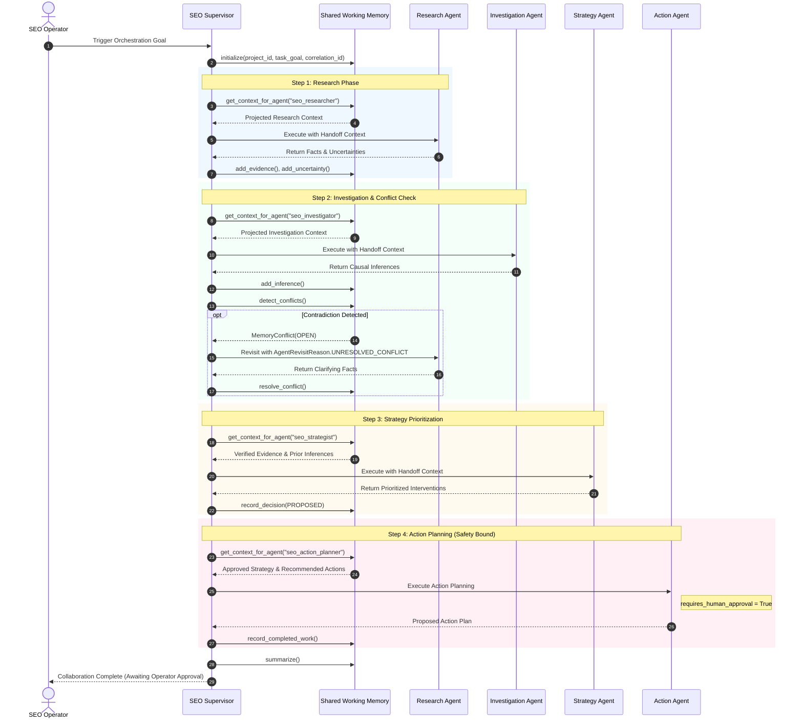

# DoxaRank Phase 5.2 — Adaptive Multi-Agent Collaboration & Shared Working Memory

## 1. Why Shared Working Memory Exists

In Phase 5.1, DoxaRank established strongly-typed agent handoffs (`AgentHandoffContext`), active state management (`CollaborationState`), and strict pre-acceptance handoff verification (`AgentHandoffValidator`). While this allowed agents to pass structured findings point-to-point, complex multi-agent workflows faced two critical challenges:

1. **Context Explosion & Redundancy**: Passing raw cumulative histories or uncontrolled conversation transcripts between every agent causes quadratic token inflation, noise accumulation, and attention dilution.
2. **Epistemic Drift & Lack of Shared State**: Downstream agents lacked a centralized, bounded representation of verified facts, working hypotheses, open uncertainties, decisions, and conflicting claims without creating an uncontrolled "chat memory" dump.

Phase 5.2 introduces a **Shared Working Memory** layer (`SharedWorkingMemory`). It maintains a compact, structured, and strictly bounded representation of the collaboration state without passing raw conversation transcripts, while projecting role-specific views tailored to each specialized agent.

---

## 2. Memory Architecture

```
                    ┌─────────────────────────┐
                    │      SEO Supervisor     │
                    └────────────┬────────────┘
                                 │ Initializes / Coordinates
                                 ▼
                    ┌─────────────────────────┐
                    │  Shared Working Memory  │
                    │  (Bounded & Epistemic)  │
                    └────────────┬────────────┘
                                 │
     ┌───────────────────────────┼───────────────────────────┐
     │ Role Projection           │ Role Projection           │ Role Projection
     ▼                           ▼                           ▼
┌───────────────┐           ┌───────────────┐           ┌───────────────┐
│Research Agent │           │ Investigation │           │Strategy Agent │
│(Facts & Gaps) │           │     Agent     │           │(Interventions)│
└───────┬───────┘           └───────┬───────┘           └───────┬───────┘
        │                           │                           │
        └───────────────────────────┼───────────────────────────┘
                                    │ Memory Ingest & Deduplication
                                    ▼
                    ┌─────────────────────────┐
                    │ Conflict Check Engine   │
                    └────────────┬────────────┘
                                 │
                 ┌───────────────┴───────────────┐
                 │                               │
                 ▼ (Conflict Detected)           ▼ (No Conflict / Resolved)
      [Bounded Agent Revisit]           ┌─────────────────┐
       (Max 2 per agent)                │  Action Planner │
                                        └────────┬────────┘
                                                 │
                                                 ▼
                                        [Human Approval Gate]
                                        (requires_approval=True)
                                                 │
                                                 ▼
                                        ┌─────────────────┐
                                        │  Verifier Agent │
                                        └─────────────────┘
```

---

## 3. Epistemic Categories

To eliminate hallucinations and prevent speculation from masquerading as empirical evidence, `SharedWorkingMemory` segregates all information into discrete epistemic stores:

| Category | Enum Identifier | Definition | Confidence Invariant | Example |
| :--- | :--- | :--- | :--- | :--- |
| **Observed Fact** | `MemoryCategory.OBSERVED_FACT` | Directly observed or tool-derived empirical evidence. | Must be `1.0` and require explicit source tool attribution. | `HTTP status 200 returned for /pricing.` |
| **Inference** | `MemoryCategory.INFERENCE` | Diagnostic hypothesis or causal deduction derived from evidence. | Bounded between `0.0` and `1.0`; must declare supporting fact IDs. | `Missing H1 tag on /pricing explains 14% CTR decline.` |
| **Uncertainty** | `MemoryCategory.UNCERTAINTY` | Explicitly declared knowledge gap, crawl limit, or ambiguity. | N/A (Flagged ambiguity). | `GSC data does not yet confirm whether CTR dropped from snippet shifts.` |
| **Assumption** | `MemoryCategory.ASSUMPTION` | Operational baseline required to proceed without blocking. | N/A. | `Anomalies reflect crawl data and 28-day Search Console correlation.` |
| **Recommendation** | `MemoryCategory.RECOMMENDATION` | Proposed strategic intervention or technical fix. | Dependent on priority calibration. | `Recommend optimizing heading hierarchy on /features.` |
| **Decision** | `MemoryCategory.DECISION` | Explicitly recorded strategic decision by the collaboration team. | Governed by `DecisionStatus` (`PROPOSED`, `ACCEPTED`, `REJECTED`, `SUPERSEDED`). | `Prioritize missing meta descriptions on high-impression pages.` |
| **Work Item** | `MemoryCategory.WORK_ITEM` | Milestone breadcrumb tracking completed or pending work. | N/A. | `Research Agent completed GSC data collection.` |
| **Verification** | `MemoryCategory.VERIFICATION` | Empirical outcome measurement after action execution. | Live verification status. | `DOM verified: H1 tag successfully present on live page.` |

> [!CAUTION]
> **Epistemic Hygiene Rule**: The system never silently promotes an inference or recommendation to an observed fact. Every observed fact requires verified tool provenance.

---

## 4. Provenance Preservation

Every entry stored in `SharedWorkingMemory` is modeled as a `MemoryItem` preserving:
- `memory_id`: Deterministic or UUID identifier (e.g. `fact-a81f32c9`).
- `category`: Epistemic category enum.
- `content`: Redacted, normalized textual statement.
- `source_agent`: Specialized agent responsible for the claim.
- `source_tool`: Originating tool (e.g., `get_gsc_performance`, `get_site_audit_summary`).
- `source_step`: Monotonically increasing execution step index.
- `correlation_id`: Distributed tracing ID.
- `confidence`: Calibrated certainty score.
- `evidence_ids`: List of supporting fact IDs backing the inference or decision.
- `metadata`: Source-specific contextual attributes (e.g., `confirmed_by_agents`).

---

## 5. Agent-Specific Context Projection

Rather than transmitting the entire working memory to every agent, the supervisor invokes `memory.get_context_for_agent(target_agent_name)` to project only role-relevant data:

- **Research Agent (`seo_researcher`)**:
  - `objective`: High-level user goal.
  - `relevant_evidence`: Multi-source GSC, ranking, and audit evidence.
  - `known_uncertainties`: Outstanding knowledge gaps.
  - `pending_research_questions`: Specific questions needing empirical data.
- **Investigation Agent (`seo_investigator`)**:
  - `objective`: High-level goal.
  - `relevant_evidence`: All empirical observed facts.
  - `research_findings`: Facts produced by the Research Agent.
  - `hypotheses`: Prior inferences.
  - `uncertainties`: Known gaps.
  - `open_conflicts`: Contradictory assertions needing causal diagnosis.
- **Strategy Agent (`seo_strategist`)**:
  - `objective`: High-level goal.
  - `verified_evidence`: High-confidence facts (`confidence >= 0.9`).
  - `investigation_findings`: Inferences from the Investigation Agent.
  - `historical_outcome_signals`: Domain win rate data and adaptive strategy lift.
  - `decisions`: Active team decisions.
- **Action Planner (`seo_action_planner`)**:
  - `approved_strategy`: Strategic recommendations and accepted decisions.
  - `recommended_actions`: Prioritized interventions.
  - `risk_information`: Strict human-in-the-loop governance parameters.
  - `approval_state`: `pending_human_approval`.
- **Verification Agent (`seo_verifier`)**:
  - `executed_actions`: Completed work items.
  - `expected_outcomes`: Target metrics and expected DOM changes.
  - `before_state_evidence`: Baseline metrics gathered prior to mutation.
  - `verification_requirements`: Action verification criteria.

---

## 6. Context Budget & Bounded Memory

To prevent unbounded memory growth during long-running or iterative collaborations, `ContextBudgetConfig` enforces deterministic upper bounds:

| Store | Limit | Eviction Strategy |
| :--- | :--- | :--- |
| `facts` | 50 | Preserves highest confidence facts; prunes oldest low-confidence facts. |
| `inferences` | 30 | Preserves highest confidence inferences; prunes oldest low-confidence inferences. |
| `uncertainties` | 20 | Prunes oldest resolved uncertainties. |
| `recommendations` | 25 | Prunes oldest uncalibrated recommendations. |
| `decisions` | 20 | Preserves accepted and proposed decisions; prunes superseded records. |
| `history_entries` | 50 | Preserves latest milestone steps. |

When a limit is reached, an `SEO_COLLABORATION_CONTEXT_BOUNDED` telemetry event is published. Critical safety state and human approval constraints are **never** evicted.

---

## 7. Memory Deduplication

When multiple agents report identical or equivalent empirical observations (e.g., multiple agents observing HTTP 200 on `/pricing`), `SharedWorkingMemory` generates a normalized SHA-256 fingerprint:

$$\text{Fingerprint} = \text{SHA256}(\text{category} + \text{normalized\_content})[:16]$$

If an identical fingerprint already exists:
1. The duplicate entry is rejected from creating a new memory slot.
2. The reporting agent is appended to the existing entry's `metadata["confirmed_by_agents"]`.
3. The `entries_deduplicated` counter is incremented.

---

## 8. Conflict Detection & Resolution

Specialized agents operating with different lenses may reach contradictory conclusions. Rather than silently overwriting claims or guessing, `SharedWorkingMemory` detects conflicts:

### Contradiction Heuristics
1. **Technical Health Discrepancy**: Research Agent claims "page is technically healthy" while Investigation Agent identifies "critical technical indexing defect".
2. **Canonicalization Conflict**: One agent asserts "page is indexable" while another claims "page is canonicalized away".
3. **Quality Disagreement**: One agent reports "high quality content" while another detects "thin / low quality content".

### Conflict Representation (`MemoryConflict`)
- `conflict_id`: Unique identifier (e.g. `conf-b712fa9e`).
- `topic`: Disputed subject area.
- `claim_a` & `claim_b`: Competing assertions with reporting agent and confidence.
- `responsible_agents`: List of involved agents.
- `resolution_status`: `OPEN` $\rightarrow$ `RESOLVED` or `ESCALATED`.

When detected, the supervisor emits `SEO_COLLABORATION_MEMORY_CONFLICT_DETECTED` and can trigger a bounded revisit. When fresh clarifying evidence is produced, `resolve_conflict()` marks the dispute `RESOLVED` and emits `SEO_COLLABORATION_MEMORY_CONFLICT_RESOLVED`.

---

## 9. Iterative Collaboration & Bounded Revisits

The supervisor can iteratively revisit an earlier agent to resolve ambiguities or fill gaps before proceeding to action planning:

### Revisit Rationale (`AgentRevisitReason`)
- `UNRESOLVED_CONFLICT`: Open dispute between agents regarding technical or ranking status.
- `MISSING_EVIDENCE`: Downstream agent identifies absent empirical baselines.
- `VERIFICATION_FAILURE`: Empirical verification failed; action planner must adjust.
- `STRATEGY_REFINEMENT`: Domain win rate calibration suggests alternative intervention.

### Revisit Safety Invariants
- `max_agent_revisits`: Maximum **2** revisits per specialized agent.
- `max_total_revisits`: Maximum **4** total revisits across the orchestration.
- `max_total_steps`: Hard upper bound of **15** total pipeline steps.
- Every revisit records a `RevisitRecord` and emits `SEO_COLLABORATION_AGENT_REVISIT`.

---

## 10. Safety Boundaries

1. **Human Approval Invariant**: Shared working memory **cannot** manufacture or grant approvals. Action proposals remain strictly `requires_human_approval = True` with status `PROPOSED`. Any attempt to record an autonomous approval is forced to `PROPOSED`.
2. **Tool Containment**: An agent's tool allowlist is immutable. Memory context cannot grant tools outside the agent's role profile.
3. **Multi-Tenant Isolation**: All memory operations enforce `project_id == active_project.id`. Cross-tenant memory access is blocked with HTTP 403 / 404.
4. **Secret Redaction**: All incoming strings, dictionaries, and raw data are sanitized using `redact_secrets()` prior to memory entry. API keys (`sk-...`, `ghp_...`), bearer tokens, and passwords are permanently masked with `***REDACTED***`.

---

## 11. Collaboration Telemetry Events

Added to `AgentEventType` in `backend/apps/seo/services/agent_events.py`:
- `seo.collaboration.memory.initialized`: Emitted when working memory is initialized for a run.
- `seo.collaboration.memory.updated`: Emitted when an agent's structured results are merged into memory.
- `seo.collaboration.memory.projected`: Emitted when a role-specific projected view is prepared for an agent.
- `seo.collaboration.memory.conflict.detected`: Emitted when contradictory claims are identified.
- `seo.collaboration.memory.conflict.resolved`: Emitted when a dispute is resolved with fresh evidence.
- `seo.collaboration.agent.revisit`: Emitted when an earlier agent is revisited with explicit rationale.
- `seo.collaboration.context.bounded`: Emitted when memory pruning or compaction executes.

---

## 12. Quantitative Evaluation Metrics

Computed by `SEOAgentEvaluationService.evaluate_shared_context()`:
- `memory_entries_created`: Total atomic memory entries generated.
- `memory_entries_deduplicated`: Count of redundant entries deduplicated via fingerprints.
- `memory_context_size`: Total active memory items currently stored.
- `memory_projection_size`: Average size of role-specific projected context passed to agents.
- `conflicts_detected`: Total multi-agent disagreements identified.
- `conflicts_resolved`: Count of successfully resolved conflicts.
- `agent_revisits`: Count of iterative agent revisits executed.
- `unnecessary_revisits`: Count of revisits without corresponding conflicts or missing evidence.
- `context_budget_exceeded`: Frequency of budget compaction triggers.
- `provenance_completeness`: Ratio of observed facts having verifiable tool attribution (0.0 to 1.0).
- `context_efficiency`: Percentage ratio of projected context size to total memory footprint.
- `collaboration_efficiency`: Percentage ratio of successful handoffs to total attempted steps.

---

## 13. REST API Endpoints

All endpoints are authenticated, read-only, and strictly tenant-isolated (`project.owner == request.user`):

### 1. Complete Memory Inspection
`GET /api/seo/ai/orchestrate/<run_id>/memory/`
Returns full structured `SharedWorkingMemory`: facts, inferences, uncertainties, decisions, conflicts, pending work, completed work, revisits.

### 2. High-Level Memory Summary
`GET /api/seo/ai/orchestrate/<run_id>/memory/summary/`
Returns compact metric counts, conflict tallies, and context efficiency percentage.

### 3. Collaboration Conflicts & Resolutions
`GET /api/seo/ai/orchestrate/<run_id>/conflicts/`
Returns detected conflict records, claims, responsible agents, and resolution statuses.

---

## 14. Target Collaboration Workflow



---

## 15. Limitations & Scope Boundaries

- **Milestone 5.2 Scope**: Shared Working Memory is scoped to active collaboration workflows.
- **Out of Scope (Future Milestones)**:
  - Long-term cross-session vector memory (Milestone 5.3+).
  - Autonomous deployment or mutation without operator approval.
  - Arbitrary agent self-replication or external agent marketplaces.
